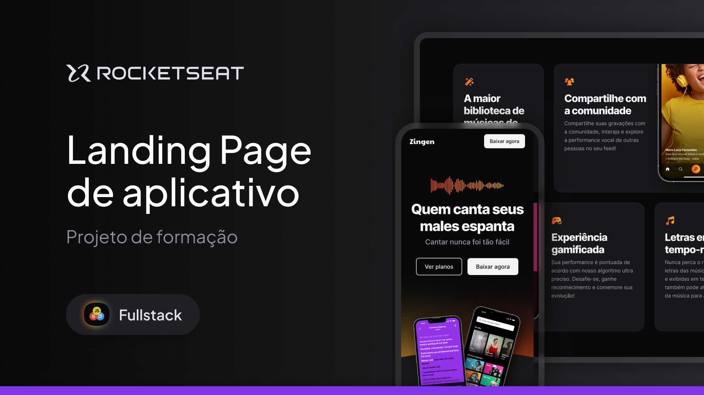

<!-- title page -->
<h1 align="center"> Zingen Karaokê </h1>

<!-- header tags -->

  <!-- Rocketseat -->
  
  <!-- / -->
  
  <!-- MBA Full Stack -->
  
  <!-- / -->
  
  <!-- Bloco 01: Fundamentos do Desenvolvimento Web -->
  
  <!-- / -->
  
  <!-- Nível 04: Avançando no HTML e CSS -->
  
  <!-- / -->
  
  <!-- Responsividade -->
  

<!-- nav -->

  <a href="#-tecnologias">Tecnologias</a>&nbsp;&nbsp;&nbsp;|&nbsp;&nbsp;&nbsp;
  <a href="#-projeto">Projeto</a>&nbsp;&nbsp;&nbsp;|&nbsp;&nbsp;&nbsp;
  <a href="#-layout">Layout</a>

<!-- cover -->

  

## 🚀 Tecnologias
Esse projeto foi desenvolvido com as seguintes tecnologias:

- HTML e CSS
- Git e Github

## 💻 Projeto
O projeto <strong>Zingen Karaokê</strong> é uma Landing Page de um aplicativo fictício de música ao vivo, o 5º projeto desenvolvido durante a MBA Full Stack da [Rocketseat](https://www.rocketseat.com.br/) em parceria com a [Sirius Education](https://landing.sirius.education/home/).   
Neste projeto foram desenvolvidas soluções em <strong>HTML</strong>, seguindo boas práticas na construção semântica de seus marcadores para a correta interpretação da sua estrutura por diferentes navegadores e também leitores de tela. Alguns atributos - como o <code>lang</code>, <code>role</code> e <code>aria-label</code> - foram utilizados de forma estratégica visando oferecer uma boa experiência aos usuários de leitores de tela.

Em seu <strong>CSS</strong> foram aplicadas soluções modernas, como o [CSS Nesting](https://developer.mozilla.org/en-US/docs/Web/CSS/CSS_nesting/Using_CSS_nesting) e os layouts Grid e Flex, além do uso de variáveis, funções e at-rules. Ademais, para a arquitetura de seus diretórios foi aplicada a técnica do [Inverted Triangle CSS (ITCSS)](https://willianjusten.com.br/organizando-seu-css-com-itcss).

## 🔖 Layout
Desenvolvido por [Ilana Mallak](https://www.linkedin.com/in/ilanamallak/), Product Designer na Rocketseat, você pode visualizar o layout do projeto através [desse link](https://www.figma.com/file/J1Z33MISC22YZB8wfxiIns/NLW-Copa-Explorer/duplicate). É necessário ter conta no [Figma](https://figma.com) para acessá-lo.